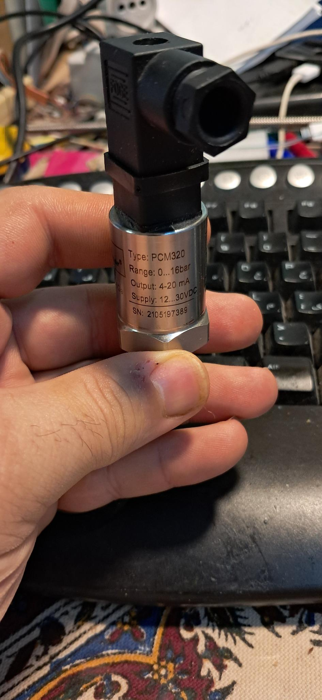
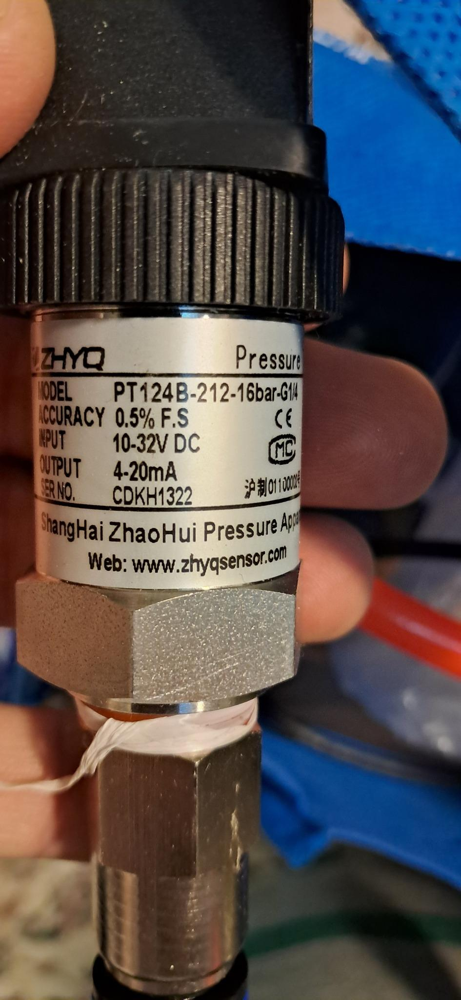

# IndustrialSensorsESP32

---

**(EN) A modular Arduino library for interfacing industrial sensors with ESP32.**  
**(FA) یک کتابخانه آردوینو برای اتصال سنسورهای صنعتی به ESP32**

## Features / ویژگی‌ها
- Analog 4-20mA sensor support with scaling  
- پشتیبانی از سنسورهای آنالوگ 4-20 میلی‌آمپر با مقیاس‌پذیری  
- Modbus RTU RS485 communication  
- ارتباط مادباس RTU با RS485  

## Examples / نمونه‌ها
- `AnalogSensorExample`: Reads a 4-20mA pressure sensor (up to 16 bar)  
- `ModbusSensorExample`: Reads one Modbus register from a sensor or device

## Real Sensor Tests / تست واقعی با سنسور

## License
MIT License – see LICENSE file.
